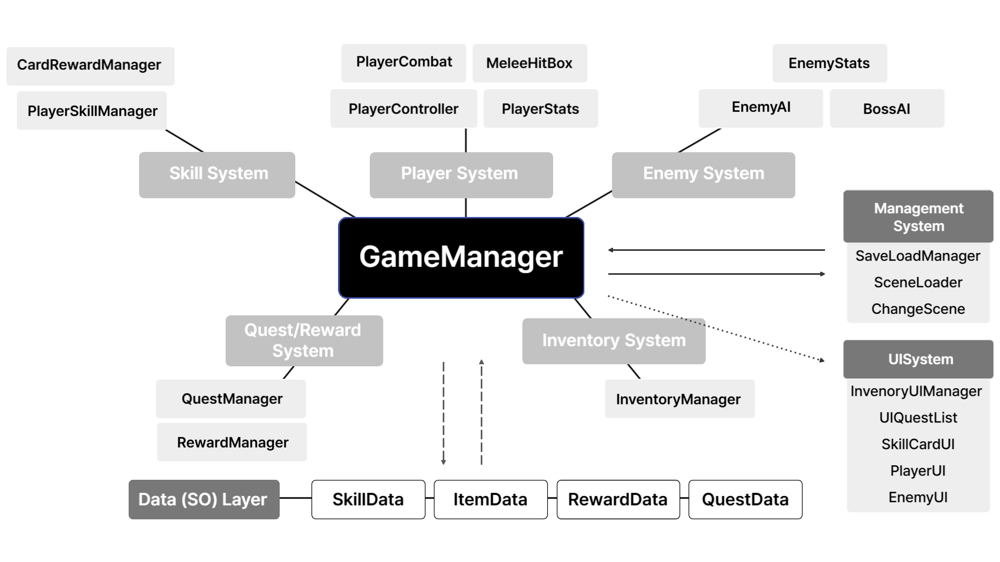
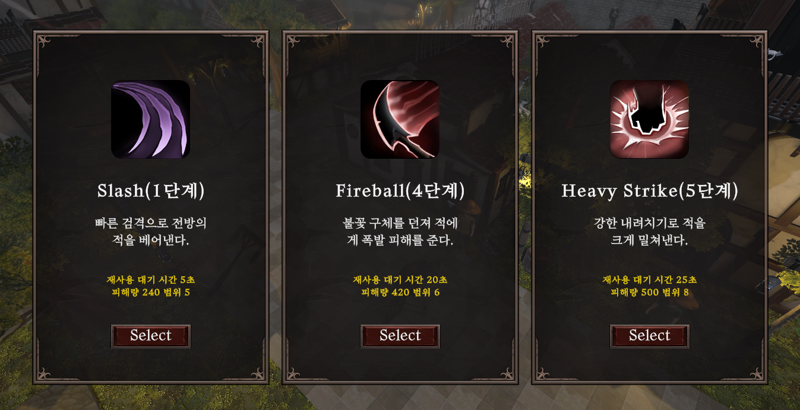
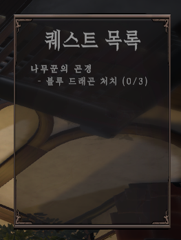
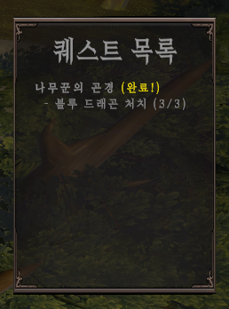
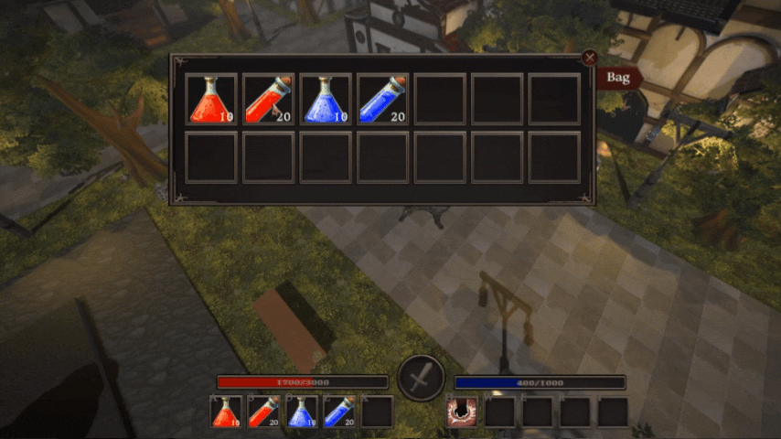
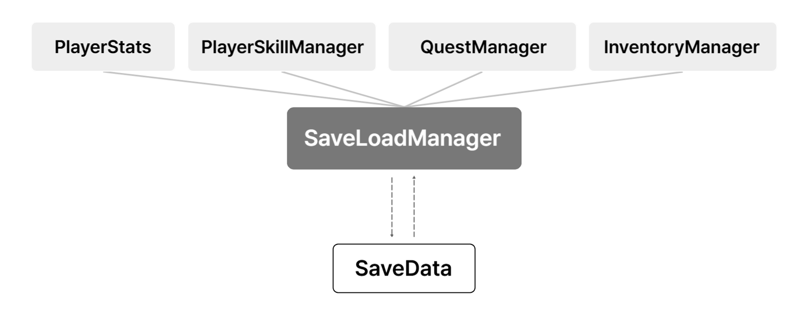
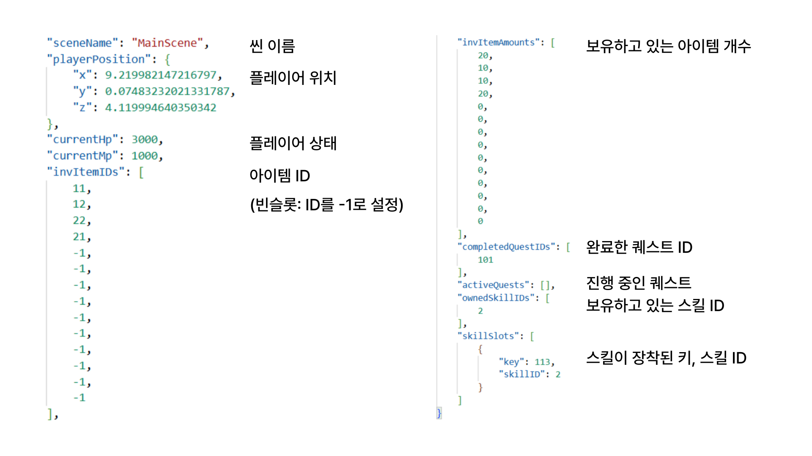

# 🐉 Shadow of the Dragon

> **개발 기간:** 2025.03 ~ 2025.10 (8개월)<br>
> **개발 형태:** 1인 개발 (기획·프로그래밍·UI 구성)<br>
> **기술 스택:** Unity 2022.3, C#<br>
> **주요 기술:** Scriptable Object, NavMesh, JSON Serialization, Singleton Pattern, DontDestroyOnLoad<br>
> **시연 영상:** <https://youtu.be/bScAAD4Z810><br>

실시간 3D 액션 RPG의 전투 시스템에 카드 기반 스킬 획득 시스템을 결합한 하이브리드 RPG입니다.

전투, AI, 퀘스트, UI, 인벤토리, 저장 시스템을 직접 구현했으며, Scriptable Object 기반 데이터 중심 구조를 적용하여 콘텐츠와 로직을 분리하고 유지보수성과 확장성을 높였습니다.

---

## 🏗️ 시스템 아키텍처
<p align="center">

</p>

프로젝트는 `GameManager`를 중심으로 각 시스템(플레이어, 전투, AI, 퀘스트, 인벤토리, UI)을 독립적으로 관리하는 Hub-and-Spoke 구조를 적용했습니다.

또한 게임 데이터는 `Scriptable Object`로 분리하여 시스템은 데이터를 참조만 하도록 설계함으로써 콘텐츠 수정 시 코드 변경 없이 데이터만 교체할 수 있도록 구성했습니다.

### Data SO Layer

| Scriptable Object | 역할               |
| ----------------- | ---------------- |
| PlayerStats       | 플레이어 능력치 관리      |
| SkillData         | 스킬 데미지, 쿨타임, 이펙트 |
| QuestData         | 퀘스트 목표 및 NPC 대사  |
| ItemData          | 아이템 메타데이터        |
| RewardData        | 퀘스트 보상 및 카드 드로우  |

---

## 📂 프로젝트 구조

```text
Assets
├── Scripts
│   ├── Player          # 플레이어 이동, 전투, 스킬
│   ├── Enemy           # 일반 몬스터 및 보스 AI
│   ├── Manager         # 전역 시스템 관리
│   ├── Quest           # 퀘스트 및 NPC 시스템
│   └── UI              # HUD 및 게임 UI
├── ScriptableObjects   # 게임 데이터(SO) 관리
├── Prefabs
├── Scenes
├── Animations
└── Resources
```

---

## 💡 주요 구현 기능

## 1. 전투 시스템

### 스킬 카드 시스템



* 확률 기반 카드 드로우를 통해 스킬 획득
* 획득한 스킬을 퀵슬롯(Q, W, E, R, T)에 장착
* Scriptable Object 기반 스킬 데이터 관리
* 스킬별 쿨타임 및 이펙트 적용

매 플레이마다 다른 스킬 조합을 구성할 수 있도록 설계하여 전략성을 높였습니다.

---

## 2. 몬스터 AI

### 일반 몬스터

Unity **NavMesh**를 활용하여 상태 기반 AI를 구현했습니다.

* Idle
* Detect
* Chase
* Attack

탐지 범위와 공격 범위를 실시간으로 판단하여 자연스럽게 상태를 전환하도록 설계했습니다.

### 보스 AI

보스는 체력 비율에 따라 공격 패턴이 변화하는 **Phase 기반 상태 머신(State Machine)** 으로 구현했습니다.

| Phase             | 패턴                     |
| ----------------- | ---------------------- |
| Phase 1 (100~70%) | 기본 공격                  |
| Phase 2 (70~30%)  | 기본 공격 + 점프 공격          |
| Phase 3 (30% 이하)  | 기본 공격 + 점프 공격 + 화염 브레스 |

---

## 3. 퀘스트 시스템

| 퀘스트 수행 시 | 퀘스트 완료 시 |
| :---: | :---: |
|  |  |

`QuestManager`와 `RewardManager`를 Singleton으로 구성하여

* 퀘스트 진행 상태 관리
* 목표 달성 여부 확인
* 보상 지급

을 전역에서 처리하도록 구현했습니다.

---

## 4. 인벤토리 시스템



* Drag & Drop 기반 슬롯 이동
* 실시간 아이템 수량 갱신
* ItemData(ScriptableObject) 기반 아이템 관리

`InventoryManager`에 `DontDestroyOnLoad`를 적용하여 마을과 필드 간 씬 이동 시에도 인벤토리 데이터가 유지되도록 구현했습니다.

---

## 5. 저장 시스템
<p align="center">

</p>

* JSON Serialization 기반 저장
* Singleton + DontDestroyOnLoad
* Application.persistentDataPath 활용
* ScriptableObject는 ID만 저장 후 복원

SaveLoadManager가 각 시스템으로부터 데이터를 수집하여 SaveData로 직렬화하고 로드 시 각 Manager에 다시 적용하는 구조로 설계했습니다.

그 결과, 씬 이동과 게임 재실행 이후에도 플레이어 상태와 진행 데이터를 복원할 수 있도록 구현했습니다.

* gamedata.json 예시


---

## 💡 기술적 문제 해결

### 1. 근접 공격 다단 히트(중복 피격) 버그 해결 및 전투 판정 최적화
* **문제 상황**: 플레이어의 근접 공격 시 하나의 공격 애니메이션에서 동일한 적에게 데미지가 여러 번 적용되어 전투 밸런스가 무너지는 문제가 발생했습니다.
* **원인 분석**:무기의 `Collider`가 적과 여러 프레임 동안 충돌하면서 `OnTriggerEnter()`가 반복 호출되었고 그 결과, 동일한 대상에게 중복으로 데미지를 주었습니다.
* **해결 과정**: 
  * 공격마다 피격한 대상(적)을 관리하는 `HashSet(_hitThisSwing)`을 도입했습니다.
  * `OnTriggerEnter()`에서 해당 적이 이미 피격한 대상인지 확인하고 이미 피격한 대상이면 `return`하여 데미지 연산을 생략하도록 수정했습니다.
  * 새로운 공격 애니메이션이 시작되는 `AttackStart()` 시점에 `ResetHitCache()`를 호출하여 피격 캐시를 초기화하도록 설계했습니다.

<details>
<summary>소스 코드 보기</summary>

```csharp
private HashSet<Collider> _hitThisSwing = new();

private void OnTriggerEnter(Collider other)
{
    // 이미 피격한 대상이면 무시
    if (_hitThisSwing.Contains(other)) 
        return;

    targetStats.TakeDamage(_owner.Damage, hitDirection);
    
    // 이번 공격의 피격 대상 등록    
    _hitThisSwing.Add(other);
}

```
공격마다 피격한 대상을 `HashSet`으로 관리하고 이미 타격한 대상은 데미지 연산을 수행하지 않도록 구현했습니다. 공격 애니메이션 시작 시 `ResetHitCache()`를 호출하여 캐시를 초기화함으로써 공격 단위의 독립적인 판정을 보장했습니다.

</details>

* **결과**: 공격 애니메이션당 동일한 대상에 대한 단일 타격을 보장하여 전투 판정의 일관성과 안정성을 확보했습니다.

### 2. 씬 전환 및 세이브 시 데이터 유실 방지
* **문제 상황**: 씬 전환 시 매니저 객체가 초기화되거나, 게임 재실행 시 인벤토리와 퀘스트 진행 정보가 유실되는 문제가 발생했습니다.
* **원인 분석**: 핵심 매니저의 생명주기가 씬에 종속되어 있었으며, 플레이 데이터를 영구적으로 저장하는 구조가 마련되어 있지 않았습니다.
* **해결 과정**:
  * 데이터를 런타임 유지와 영구 저장 두 계층으로 분리하여 구조를 재설계했습니다.
  * **런타임 데이터 유지**: `GameManager`, `InventoryManager` 등 핵심 매니저에 Singleton 패턴과 `DontDestroyOnLoad`를 적용하여 씬 전환 시에도 객체가 유지되도록 구현했습니다.
  * **로컬 영구 저장**: `SaveLoadManager`를 구현하여 플레이어 위치, HP/MP, 인벤토리, 퀘스트 진행 정보를 JSON으로 직렬화한 뒤 `Application.persistentDataPath`에 저장 및 복원하도록 구현했습니다.

<details>
<summary>소스 코드 보기</summary>

```csharp
// ScriptableObject는 ID만 저장
data.ownedSkillIDs.Add(skill.id);

// ID를 통해 ScriptableObject 복원
foreach (int id in currentSaveData.ownedSkillIDs)
{
        SkillData skill = allSkillDatabase.Find(x => x.id == id);
        
        if (skill != null) 
            loadedOwned.Add(skill);
}

```
ScriptableObject를 직접 저장하지 않고 ID만 저장한 뒤 데이터베이스에서 다시 참조하도록 구현하여 저장 데이터의 크기를 줄이고 ScriptableObject와 저장 데이터를 분리하여 유지보수성을 높였습니다.

</details>

* **결과**: 런타임 데이터와 영구 저장 데이터를 분리하여 씬 전환 시 핵심 시스템이 안정적으로 유지되었고 게임 재실행 후에도 마지막 플레이 상태를 정상적으로 복원할 수 있도록 데이터 영속성 구조를 구축했습니다.

---

## 🚀 회고 및 성장

이번 프로젝트를 통해 **Scriptable Object 기반 데이터 중심 설계(Data-Driven Design)** 와 시스템을 Manager 단위로 분리하여 각 기능을 독립적으로 관리하는 구조를 경험했습니다.

게임 데이터를 코드와 분리하여 관리함으로써 밸런스 조정이나 콘텐츠 수정 시 코드 변경 없이 Scriptable Object 에셋만 수정할 수 있었으며, 기능별 Manager를 통해 시스템 간 의존성을 낮춰 유지보수성과 확장성을 높일 수 있었습니다.

또한 전투 시스템을 직접 구현하며 충돌 판정과 애니메이션 타이밍을 동기화하는 과정의 중요성을 체감했습니다. 이후 Unreal Engine의 Root Motion과 Anim Notify 구조를 학습하면서 엔진이 제공하는 프레임워크가 이러한 문제를 체계적으로 해결하는 방식을 이해하게 되었습니다. 앞으로는 엔진의 기본 시스템을 적극 활용하여 유지보수성과 확장성을 고려한 전투 시스템을 설계하고자 합니다.
